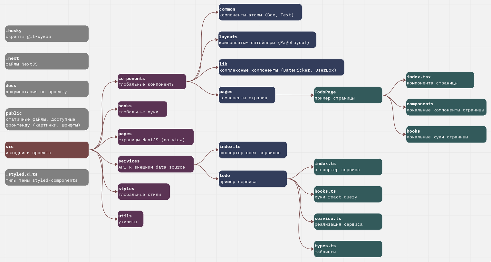

## Init project
```bash
npx create-next-app --example https://github.com/mish/templates/next-js project-name
```

## Getting Started
First, run the development server:

```bash
yarn dev
```

## Learn More
- [Next.js Documentation](https://nextjs.org/docs) - learn about Next.js features and API.
-  graphical representation of this project structure
